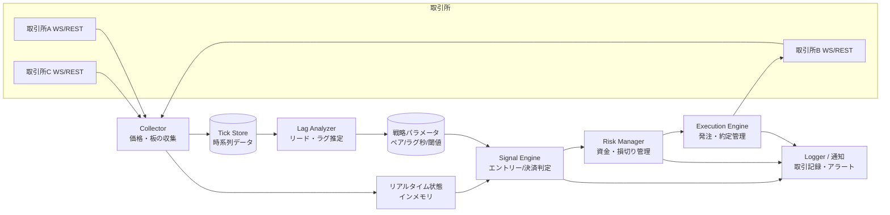

# 暗号資産リード・ラグ追随ツール 設計書(第2稿)

自分用ツールとして、複数マーケットを監視し、同一通貨で値動きに時間差(ラグ)のある市場ペアを見つけ、
**先行市場(リーダー)の動きに合わせて遅行市場(フォロワー)で発注・売却する**ためのシステムの設計。

> この文書は「一緒に設計する」ための叩き台。各所に ❓ 印で意思決定が必要な項目を残してある。

## 決定事項(第2稿時点)

| 項目 | 決定 | 設計への反映 |
|---|---|---|
| 対象取引所 | **海外も使う** | 海外大手(Binance 等)を**リーダー(データソース専用)**、国内取引所を**フォロワー(発注先)**とする。海外側は公開データの購読のみなので口座開設不要(§2.1) |
| 対象通貨 | **まず BTC、拡張余地を残す** | 通貨ペアは設定ファイルのリストで管理し、全コンポーネントを複数シンボル前提で実装。初期設定は BTC のみ(§4) |
| 実行環境 | **自宅マシン** | 自宅回線・電源断を前提にしたセーフティ設計を必須要件に(§4.1)。VPS は将来の移行先として温存 |

---

## 1. 戦略の整理

### 1.1 やりたいことの言語化

1. 複数の取引所で同一通貨(例: BTC/JPY, ETH/JPY)の価格をリアルタイム監視する
2. 「取引所Aが動いた数秒〜数十秒後に取引所Bが追随する」という**リード・ラグ関係**を統計的に検出する
3. リーダーが有意に動いたら、フォロワー側でその方向にエントリーし、追随が完了したら決済する

これは一般に **lead-lag 戦略(レイテンシ・アービトラージの一種)** と呼ばれる手法。

### 1.1.1 役割分担(決定済み)

- **リーダー(監視のみ)**: 海外大手取引所。第一候補 **Binance の BTC/USDT**(世界最大の出来高で価格発見が最も速い)。公開 WebSocket を購読するだけなので**口座は不要**
- **フォロワー(発注先)**: 国内取引所の **BTC/JPY**。実際に売買するのはこちらだけなので、資金・APIキーは国内側にのみ置く

この構成の利点: 海外口座の開設・資金移動・海外送金が一切不要で、税務も国内の JPY 建て売買だけで完結する。

**通貨建ての違いへの対処**: リーダーは USDT 建て、フォロワーは JPY 建てなので、価格そのものではなく**リターン(変化率)で比較**する。USD/JPY の為替変動はノイズとして乗るが、数秒〜数十秒スケールでは BTC の値動きに比べて十分小さい。補正用に USD/JPY レートも低頻度(分単位)で記録しておく。

### 1.2 先に共有しておきたい現実的なリスク

設計の前提として重要なので最初に書いておく。

- **「ラグ」の多くは見かけ上のもの**: 板が薄い・配信が遅い市場は「遅れて見える」だけで、実際に注文を出すと約定価格はすでに動いていることが多い。→ 検証フェーズ(Phase 1-2)で「本当に取れるラグか」をデータで確認してから実弾に進む構成にする。
- **コストの壁**: 国内取引所の taker 手数料 + スプレッド + スリッページの往復コストは 0.1〜0.3% 程度になりがち。ラグで取れる値幅がこれを上回るケースは限定的。→ 「期待エッジ > 往復コスト」を常に数値で判定する仕組みを中核に置く。
- **在庫リスク**: フォロワー側でポジションを持つ以上、追随しなかった場合の損切りルールが必須。
- **API 規約**: 各取引所の API 利用規約(レート制限、自動売買の可否)を遵守する。

---

## 2. 全体アーキテクチャ



### コンポーネントの責務

| コンポーネント | 責務 |
|---|---|
| **Collector** | 各取引所の WebSocket で best bid/ask・約定・板を購読し、タイムスタンプ付きで記録。切断時の自動再接続 |
| **Tick Store** | 生ティックの永続化。ラグ分析・バックテストの材料 |
| **Lag Analyzer** | 蓄積データから市場ペアごとのリード・ラグ関係を推定(オフライン/定期バッチ) |
| **Signal Engine** | リーダーの値動きを監視し、閾値超えでフォロワー側のエントリー/決済シグナルを生成 |
| **Risk Manager** | 1トレード上限額、同時ポジション数、日次損失上限、タイムアウト損切り |
| **Execution Engine** | 実際の発注・キャンセル・約定確認。**paper モード(仮想約定)と live モードを切替可能に** |
| **Logger/通知** | 全シグナル・全注文の記録。異常時の通知(LINE/Discord/メール等) |

分析(バッチ)と執行(リアルタイム)を分離するのがポイント。ラグの推定は重い処理なので裏で回し、執行側は軽量なパラメータ(「このペア、ラグ N 秒、閾値 X%」)だけを参照する。

---

## 3. ラグ検出の設計(コアロジック)

### 3.1 推定方法

1. 各市場の mid 価格(=(bid+ask)/2)を 100ms〜1s 間隔でリサンプリング
2. リターン系列同士の**相互相関(cross-correlation)を時間シフトさせながら計算**し、相関が最大になるシフト量 = ラグ推定値
3. ローリングウィンドウ(例: 直近6時間)で定期再計算し、ラグ関係の変化に追随
4. 統計的に有意なペアだけを「取引可能ペア」として Signal Engine に渡す

判定条件の例:
- 最大相関係数 ≥ 0.6(❓ 要調整)
- 推定ラグ ≥ 実効執行レイテンシ(自分の発注が届くまでの時間)+ 余裕
- 直近 N 回の再計算でラグの符号・大きさが安定している

### 3.2 シグナル条件(案)

```
エントリー(買いの例):
  リーダーの mid が直近 T 秒で +X% 以上動いた
  かつ フォロワーがまだ +X*α% 未満しか動いていない(α < 1)
  かつ 期待利幅(X による予測追随幅 − 往復コスト)> 最低利幅
  → フォロワーで成行 or ベストプライス指値の買い

決済:
  フォロワーが追随を完了(リーダーとの乖離が正常域に収束)
  or 保有時間がラグ推定値の k 倍を超過(タイムアウト)
  or 損切りライン到達
  → 売却
```

パラメータ(T, X, α, k, 損切り幅)はすべて設定ファイル化し、バックテストで最適化する。

---

## 4. 技術スタック(推奨案)

| 項目 | 推奨 | 理由 |
|---|---|---|
| 言語 | **Python 3.12 + asyncio** | 取引所ライブラリと分析エコシステムが最も充実。個人ツールの開発速度重視 |
| 取引所接続 | **ccxt**(REST)+ 各社ネイティブ WebSocket | ccxt は国内外の主要取引所に対応し発注 API を統一化できる。WS はレイテンシ重視でネイティブ実装も検討 |
| ティック保存 | **Parquet ファイル + DuckDB** | サーバ不要・ファイルベースで分析が高速。個人規模なら十分 |
| リアルタイム状態 | プロセス内メモリ(dict) | 単一プロセス構成なら Redis 等は不要 |
| 設定 | YAML(取引所・通貨ペア・パラメータ・モード) | コード変更なしで調整可能に |
| 監視 UI | 最初はログ + 通知のみ。必要になったら Streamlit で簡易ダッシュボード | UI を先に作らない |
| 実行環境 | **自宅マシン(決定)** | 下記 §4.1 のセーフティ設計を前提とする |

通貨ペアの拡張性(決定事項の反映): 監視対象は `strategy.yaml` のリストで定義し、Collector・Analyzer・Signal Engine はすべて「シンボルのリストをループする」汎用実装にする。BTC 固有のロジックはどこにも書かない。将来 ETH 等を足すときは設定に1行追加するだけ。

### 4.1 自宅マシン運用のためのセーフティ設計

VPS(Virtual Private Server)= 月額数百〜千円程度で借りられる、データセンター内の常時稼働の仮想マシンのこと。停電・回線断がなく取引所に近いのが利点だが、まずは自宅マシンで始める。その代わり以下を必須要件とする:

- **フェイルセーフ原則「落ちたら止まる」**: プロセス異常終了・WS切断・PC再起動のとき、勝手に取引を再開しない。ポジション保有中に接続を失ったら、復帰時にまず現在ポジションを取引所 API で照会し、想定と違えば全決済して停止
- **ウォッチドッグ**: データ受信が N 秒途絶えたら新規エントリー禁止 → M 秒でポジション全決済。ハートビートログを常時出力
- **スリープ・自動更新の無効化**: OS のスリープ、Windows Update 等の自動再起動を止める(運用手順書に明記)
- **時刻同期**: NTP 同期を必須に。ラグ推定はミリ秒精度のタイムスタンプに依存するため、時計がずれると分析が全部狂う
- **プロセス自動再起動**: systemd / タスクスケジューラで collector は自動復帰(収集は再開してよい。執行は上記原則に従い手動確認後に再開)
- **将来の移行**: 実弾フェーズで自宅回線の切断が問題になったら、収集+執行だけ国内 VPS に移す。コンポーネント分離構成(§2)なのでプロセス単位で移せる

❓ 言語の好みがあれば変更可(例: TypeScript/Node でも成立する。ただし分析側は Python が楽)。
❓ 自宅マシンの OS(Windows / Mac / Linux)。運用手順(スリープ無効化・自動起動)の書き方が変わる。

---

## 5. 開発フェーズ(重要: 段階的に進める)

いきなり自動売買を作らず、**各フェーズで「前提が成立しているか」を検証してから次へ進む**。

### Phase 1: データ収集(まずこれだけ作る)— 詳細設計

**購読対象(初期構成)**

| 役割 | 取引所 | シンボル | 購読ストリーム |
|---|---|---|---|
| リーダー | Binance | BTC/USDT | bookTicker(best bid/ask)+ trade(約定) |
| リーダー予備 | Bybit | BTC/USDT | 同上(Binance 障害時の比較用、余裕があれば) |
| フォロワー | 国内取引所(❓口座がある所) | BTC/JPY | best bid/ask + 約定 + 板上位数段 |
| 補助 | 為替レートAPI | USD/JPY | 1分間隔の REST 取得で十分 |

フォロワー側は板の上位数段も録る(Phase 3 でスリッページを模擬するのに必要)。

**記録スキーマ(quotes)**

```
ts_local      受信時刻(自分のマシン、UTC、ミリ秒)   ← ラグ分析はこちらを使う
ts_exchange   取引所打刻(あれば)                    ← 配信遅延の計測用
exchange      取引所ID
symbol        通貨ペア
bid, ask      最良気配
bid_qty, ask_qty  数量
```

trades(約定)も同様に price / qty / side を記録。書き込みは「メモリにバッファ → 1分ごとに Parquet 追記」で、ファイルは `data/{quotes|trades}/date=YYYY-MM-DD/exchange=XX/*.parquet` にパーティション分割。

**データ量の目安**: BTC 1通貨・4市場程度なら 1日あたり数百MB以内。自宅マシンのディスクで数ヶ月は問題ない。古いデータは月単位で外付け/クラウドに退避。

**運用**: collector は systemd 等で常駐・自動再起動(§4.1)。日次で「受信件数・最大欠損時間・取引所ごとの配信遅延」のサマリを通知に流し、収集が死んでいたら気付けるようにする。

- **完了条件**: 1週間分の連続データが欠損少なく貯まる(欠損合計 < 1%/日 目安)

### Phase 2: ラグ分析・検証
- 相互相関によるラグ推定の実装
- 「ラグで取れたはずの値幅」vs「往復コスト」の集計レポート
- **完了条件**: コスト控除後にプラスが残るペア・条件が実データで見つかる
- ⚠️ ここで見つからなければ、戦略の見直し(対象通貨拡大・条件変更)に戻る。**実弾には進まない**

### Phase 3: シグナル生成 + ペーパートレード
- リアルタイムのシグナル判定と仮想約定(板情報からスリッページも模擬)
- 数週間走らせて仮想損益を集計
- **完了条件**: ペーパーで安定してプラス

### Phase 4: 少額実弾
- Execution Engine を live モードに。最小ロット・1ペア限定から
- Risk Manager の上限(1トレード額、日次損失上限)を厳格に
- ペーパーとの乖離(スリッページ実測)を分析し、Phase 3 のモデルに反映

### Phase 5: 運用改善
- 対象ペア拡大、パラメータ自動再調整、ダッシュボード、障害時セーフティ(WS 切断時は全ポジション決済 or 発注停止)

---

## 6. ディレクトリ構成(案)

```
crypto-lag-trader/
├── config/
│   ├── exchanges.yaml      # 取引所・通貨ペア・APIキー参照(キー本体は .env)
│   └── strategy.yaml       # 閾値・ラグ・リスク上限・モード(paper/live)
├── src/
│   ├── collector/          # WS購読・ティック記録
│   ├── analyzer/           # ラグ推定・コスト分析・レポート
│   ├── engine/             # signal / risk / execution
│   ├── exchanges/          # 取引所ごとのアダプタ(共通インターフェース)
│   └── notify/             # 通知
├── data/                   # Parquet ティックデータ(git管理外)
├── backtest/               # 記録データからの再生・検証
└── tests/
```

取引所アダプタは `subscribe_ticker() / place_order() / cancel() / fetch_balance()` の共通インターフェースに揃え、取引所追加を差し替え可能にする。

---

## 7. ❓ 次に決めたいこと(意思決定リスト)

決定済み: 対象取引所の構成(海外リーダー/国内フォロワー)、対象通貨(BTC、設定で拡張可)、実行環境(自宅マシン)→ 冒頭の決定事項参照。

残っている項目:

1. **フォロワーにする国内取引所**: 口座を持っている(または作る予定の)取引所はどこか。bitFlyer / GMOコイン / bitbank あたりは「取引所」形式(板取引)があり手数料が低い。※「販売所」形式しかないペアはスプレッドが広すぎて対象外
2. **資金規模**: 1トレードあたり・全体の上限額(Risk Manager の初期値に使う)
3. **言語**: Python 案で良いか
4. **通知先**: LINE / Discord / メール のどれか
5. **自宅マシンの OS**: Windows / Mac / Linux(常駐化の手順が変わる)

---

## 8. スコープ外(今回はやらないこと)

- 両建て型の純粋アービトラージ(両取引所に資金を置いて同時売買)— 将来の拡張候補
- レバレッジ・ショート — まずは現物の買い→売りのみ
- 機械学習による予測 — まず相互相関ベースで成立するかを確認
