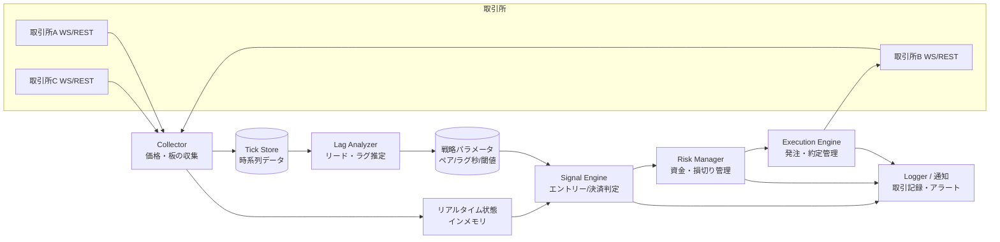

# 暗号資産リード・ラグ追随ツール 設計書(第4稿)

自分用ツールとして、複数マーケットを監視し、同一通貨で値動きに時間差(ラグ)のある市場ペアを見つけ、
**先行市場(リーダー)の動きに合わせて遅行市場(フォロワー)で発注・売却する**ためのシステムの設計。

> この文書は「一緒に設計する」ための叩き台。各所に ❓ 印で意思決定が必要な項目を残してある。

## 決定事項(第4稿時点)

| 項目 | 決定 | 設計への反映 |
|---|---|---|
| 対象取引所 | **海外も使う** | 海外大手(Binance グローバル等)は**監視専用データソース**(口座不要)。執行は国内登録業者のみ(§1.1.1〜1.1.2)。グローバル版海外取引所は日本居住者は取引不可のため執行先にしない |
| 執行先口座 | **bitFlyer + Binance Japan(確認済み)**。有力な取引所があれば追加開設OK | 追加候補と開設判断の進め方は §1.1.3。監視は口座不要なので、まず全候補のデータを録り、エッジが見えた所だけ口座を作る |
| 対象通貨 | **まず BTC、拡張余地を残す** | 通貨ペアは設定ファイルのリストで管理し、全コンポーネントを複数シンボル前提で実装。初期設定は BTC のみ(§4) |
| 資金規模 | **少額スタート、後から調整可能に** | 上限額はすべて `strategy.yaml` のリスク設定で管理(§3.3)。初期値は最小ロット近辺、コード変更なしで増額可能 |
| 実行環境 | **自宅マシン(Windows)** | Windows 前提のセーフティ設計・常駐化手順に具体化(§4.1) |
| 通知 | **メール** | SMTP 送信(§4.2)。日次サマリ+異常時アラート |

---

## 1. 戦略の整理

### 1.1 やりたいことの言語化

1. 複数の取引所で同一通貨(例: BTC/JPY, ETH/JPY)の価格をリアルタイム監視する
2. 「取引所Aが動いた数秒〜数十秒後に取引所Bが追随する」という**リード・ラグ関係**を統計的に検出する
3. リーダーが有意に動いたら、フォロワー側でその方向にエントリーし、追随が完了したら決済する

これは一般に **lead-lag 戦略(レイテンシ・アービトラージの一種)** と呼ばれる手法。

### 1.1.1 役割分担

- **監視(watch)**: 海外大手取引所の公開データ。第一候補 **Binance グローバル版の BTC/USDT**(世界最大の出来高で価格発見が最も速い)。公開 WebSocket を購読するだけなので**口座は不要**
- **執行(trade)**: 日本で登録済みの取引所の **BTC/JPY**。資金・APIキーはこちらにのみ置く

役割は取引所ごとに設定ファイルで `role: [watch] / [watch, trade]` として指定する。「どこがリーダーでどこがフォロワーか」はコードに固定せず、Lag Analyzer の推定結果(ペアごと)として扱う。これにより執行可能な取引所が増減しても設定変更だけで対応できる。

**通貨建ての違いへの対処**: 監視側は USDT 建て、執行側は JPY 建てなので、価格そのものではなく**リターン(変化率)で比較**する。USD/JPY の為替変動はノイズとして乗るが、数秒〜数十秒スケールでは BTC の値動きに比べて十分小さい。補正用に USD/JPY レートも低頻度(分単位)で記録しておく。

### 1.1.2 海外口座を執行に使えるか(2026年7月時点の調査結果)

結論: **グローバル版の海外取引所は日本居住者の執行先としては実質使えない。ただし Binance Japan は国内登録業者なので執行に使える。**

- **Binance グローバル版**: 2023年11月30日で日本居住者向けサービスを終了し、日本ユーザーは Binance Japan へ移行済み。グローバル口座が残っていても出金のみ可能で取引機能は停止されている
- **Binance Japan**: 金融庁登録済みの国内業者。JPY 建てで国内最多水準(2026年1月時点で68通貨)を取り扱う。**執行先候補として有力**
- **Bybit**: 金融庁から無登録営業の警告を3度受けたのち日本撤退を発表。2026年3月23日以降、日本居住者のアカウントは決済専用(クローズオンリー)モードで新規取引不可
- その他の無登録海外業者も2025年2月に日本のアプリストアから削除されるなど締め出しが進んでおり、新規に使う選択肢としては考えない

設計への影響:
- 執行先 = **国内登録業者のみ**(bitFlyer / Binance Japan / GMOコイン / bitbank など)。これは §1.1.1 の役割分担と矛盾しない — 海外グローバル版は引き続き watch 専用のデータソースとして使う(公開データの購読に居住地制限はない)
- 執行先が **bitFlyer + Binance Japan の2社**になると、両方に資金を置いて「安い方で買い・高い方で売り」を同時に行う**両建て型アービトラージ**(方向リスクなし)が国内 JPY 建てだけで組めるようになる。§8 のスコープ外としていたが、現実的な拡張候補に格上げする

### 1.1.3 追加口座の候補と開設判断の進め方

重要な前提: **監視(データ収集)は公開データなので口座不要**。したがって「先に全候補のデータを録り、Phase 2 の分析でエッジ(ラグ・価格乖離)が実際に見えた取引所だけ口座を開設する」のが最も無駄がない。口座開設は Phase 3(ペーパートレード)までに間に合えばよい。

国内の候補(BTC/JPY の板取引があり API が使えるところ):

| 取引所 | 特徴 | 優先度 |
|---|---|---|
| **bitFlyer**(保有) | BTC/JPY の国内最大級の流動性。API(Lightning)が充実 | 確定 |
| **Binance Japan**(保有) | 手数料が安い。取扱通貨最多で将来の通貨拡張にも有利 | 確定 |
| **GMOコイン** | **maker 手数料がマイナス(リベート)**、taker も低率。WS API の品質に定評。指値中心の戦略なら手数料面で最有力 | 高 |
| **bitbank** | maker マイナス手数料。アルト系の板が国内では厚め。通貨拡張時に有利 | 中 |
| **Coincheck** | BTC 取引所の手数料が無料。ただし API・板の薄さは要確認 | 中 |

方針: Phase 1 の Collector は**この5社すべて + Binance グローバル(watch)を最初から購読**する(口座不要・追加コストほぼゼロ)。Phase 2 のレポートに「取引所ペアごとのエッジ集計」を含め、その数字を見て3社目以降の口座開設を判断する。

※ 手数料率は変更されることがあるため、実装時に各社の最新の手数料表を確認し `exchanges.yaml` に記録する。手数料はシグナル判定(期待エッジ > 往復コスト)の入力値なので、設定として持つ。

### 1.2 先に共有しておきたい現実的なリスク

設計の前提として重要なので最初に書いておく。

- **「ラグ」の多くは見かけ上のもの**: 板が薄い・配信が遅い市場は「遅れて見える」だけで、実際に注文を出すと約定価格はすでに動いていることが多い。→ 検証フェーズ(Phase 1-2)で「本当に取れるラグか」をデータで確認してから実弾に進む構成にする。
- **コストの壁**: 国内取引所の taker 手数料 + スプレッド + スリッページの往復コストは 0.1〜0.3% 程度になりがち。ラグで取れる値幅がこれを上回るケースは限定的。→ 「期待エッジ > 往復コスト」を常に数値で判定する仕組みを中核に置く。
- **在庫リスク**: フォロワー側でポジションを持つ以上、追随しなかった場合の損切りルールが必須。
- **API 規約**: 各取引所の API 利用規約(レート制限、自動売買の可否)を遵守する。

---

## 2. 全体アーキテクチャ



### コンポーネントの責務

| コンポーネント | 責務 |
|---|---|
| **Collector** | 各取引所の WebSocket で best bid/ask・約定・板を購読し、タイムスタンプ付きで記録。切断時の自動再接続 |
| **Tick Store** | 生ティックの永続化。ラグ分析・バックテストの材料 |
| **Lag Analyzer** | 蓄積データから市場ペアごとのリード・ラグ関係を推定(オフライン/定期バッチ) |
| **Signal Engine** | リーダーの値動きを監視し、閾値超えでフォロワー側のエントリー/決済シグナルを生成 |
| **Risk Manager** | 1トレード上限額、同時ポジション数、日次損失上限、タイムアウト損切り |
| **Execution Engine** | 実際の発注・キャンセル・約定確認。**paper モード(仮想約定)と live モードを切替可能に** |
| **Logger/通知** | 全シグナル・全注文の記録。異常時の通知(LINE/Discord/メール等) |

分析(バッチ)と執行(リアルタイム)を分離するのがポイント。ラグの推定は重い処理なので裏で回し、執行側は軽量なパラメータ(「このペア、ラグ N 秒、閾値 X%」)だけを参照する。

---

## 3. ラグ検出の設計(コアロジック)

### 3.1 推定方法

1. 各市場の mid 価格(=(bid+ask)/2)を 100ms〜1s 間隔でリサンプリング
2. リターン系列同士の**相互相関(cross-correlation)を時間シフトさせながら計算**し、相関が最大になるシフト量 = ラグ推定値
3. ローリングウィンドウ(例: 直近6時間)で定期再計算し、ラグ関係の変化に追随
4. 統計的に有意なペアだけを「取引可能ペア」として Signal Engine に渡す

判定条件の例:
- 最大相関係数 ≥ 0.6(❓ 要調整)
- 推定ラグ ≥ 実効執行レイテンシ(自分の発注が届くまでの時間)+ 余裕
- 直近 N 回の再計算でラグの符号・大きさが安定している

### 3.2 シグナル条件(案)

```
エントリー(買いの例):
  リーダーの mid が直近 T 秒で +X% 以上動いた
  かつ フォロワーがまだ +X*α% 未満しか動いていない(α < 1)
  かつ 期待利幅(X による予測追随幅 − 往復コスト)> 最低利幅
  → フォロワーで成行 or ベストプライス指値の買い

決済:
  フォロワーが追随を完了(リーダーとの乖離が正常域に収束)
  or 保有時間がラグ推定値の k 倍を超過(タイムアウト)
  or 損切りライン到達
  → 売却
```

パラメータ(T, X, α, k, 損切り幅)はすべて設定ファイル化し、バックテストで最適化する。

### 3.3 リスク設定(少額スタート・後から調整可能)

資金規模に関わる値はすべて `strategy.yaml` の `risk` セクションに集約し、**コード変更なしで増減できる**ようにする。

```yaml
risk:
  max_order_jpy: 5000        # 1注文の上限額(初期値: 最小ロット近辺の少額)
  max_position_jpy: 10000    # 同時保有ポジションの合計上限
  max_daily_loss_jpy: 3000   # 日次損失上限。超えたらその日は新規エントリー停止
  max_trades_per_day: 20     # 日次取引回数上限(暴走防止)
  kill_switch: false         # true にすると即座に新規停止+全決済
```

- 初期値は各取引所の最小注文数量(BTC はおおむね 0.0001〜0.001 BTC)が通る程度の少額に設定する
- Risk Manager は**すべての注文をこの設定と照合してから** Execution Engine に渡す。設定ファイルは起動時読み込み+定期リロードとし、稼働中でも値を変更できる
- 増額は「ペーパー/少額実弾の成績を見てから手動で設定変更」が原則。自動増額はしない

---

## 4. 技術スタック(推奨案)

| 項目 | 推奨 | 理由 |
|---|---|---|
| 言語 | **Python 3.12 + asyncio** | 取引所ライブラリと分析エコシステムが最も充実。個人ツールの開発速度重視 |
| 取引所接続 | **ccxt**(REST)+ 各社ネイティブ WebSocket | ccxt は国内外の主要取引所に対応し発注 API を統一化できる。WS はレイテンシ重視でネイティブ実装も検討 |
| ティック保存 | **Parquet ファイル + DuckDB** | サーバ不要・ファイルベースで分析が高速。個人規模なら十分 |
| リアルタイム状態 | プロセス内メモリ(dict) | 単一プロセス構成なら Redis 等は不要 |
| 設定 | YAML(取引所・通貨ペア・パラメータ・モード) | コード変更なしで調整可能に |
| 監視 UI | 最初はログ + 通知のみ。必要になったら Streamlit で簡易ダッシュボード | UI を先に作らない |
| 実行環境 | **自宅マシン(決定)** | 下記 §4.1 のセーフティ設計を前提とする |

通貨ペアの拡張性(決定事項の反映): 監視対象は `strategy.yaml` のリストで定義し、Collector・Analyzer・Signal Engine はすべて「シンボルのリストをループする」汎用実装にする。BTC 固有のロジックはどこにも書かない。将来 ETH 等を足すときは設定に1行追加するだけ。

### 4.1 自宅マシン(Windows)運用のためのセーフティ設計

VPS(Virtual Private Server)= 月額数百〜千円程度で借りられる、データセンター内の常時稼働の仮想マシンのこと。停電・回線断がなく取引所に近いのが利点だが、まずは自宅マシンで始める。その代わり以下を必須要件とする:

- **フェイルセーフ原則「落ちたら止まる」**: プロセス異常終了・WS切断・PC再起動のとき、勝手に取引を再開しない。ポジション保有中に接続を失ったら、復帰時にまず現在ポジションを取引所 API で照会し、想定と違えば全決済して停止
- **ウォッチドッグ**: データ受信が N 秒途絶えたら新規エントリー禁止 → M 秒でポジション全決済。ハートビートログを常時出力
- **時刻同期**: NTP 同期を必須に。ラグ推定はミリ秒精度のタイムスタンプに依存するため、時計がずれると分析が全部狂う

Windows 固有の運用手順(Phase 1 実装時に手順書化する):

- **常駐化**: collector はタスクスケジューラの「スタートアップ時に実行+失敗時に再起動」で登録(または NSSM で Windows サービス化)。収集は自動復帰してよい。執行プロセスはフェイルセーフ原則に従い、再起動後は手動確認してから起動
- **スリープ無効化**: 電源設定でスリープ/休止を「なし」に。ノートPCなら蓋を閉じても何もしない設定に
- **Windows Update の自動再起動対策**: アクティブ時間の設定+再起動は手動タイミングで実施(ポジションがない時間帯に)。実弾フェーズでは「再起動保留中は新規エントリー禁止」もウォッチドッグに含める
- **時刻同期の強化**: Windows 標準の time.windows.com は同期間隔が長いので、NTP 同期間隔を短く設定する(w32tm の設定変更)
- **開発・実行環境**: Python は Windows ネイティブで動かす(WSL2 は不要。スリープ・時刻同期の挙動が複雑になるため使わない)
- **将来の移行**: 実弾フェーズで自宅回線の切断が問題になったら、収集+執行だけ国内 VPS(Linux)に移す。コード側は OS 依存を避け、常駐化の仕組みだけ OS ごとに分ける

### 4.2 通知(メール)

- **送信方法**: SMTP。Gmail のアプリパスワード(または SendGrid 等)を `.env` に保持
- **日次サマリ**(定時1通): 受信件数・欠損時間・配信遅延・(稼働後は)シグナル数・損益
- **アラート**(即時): WS 長時間切断、プロセス異常終了、ウォッチドッグ発動、日次損失上限到達、kill switch 作動
- **設計上の注意**: メールは遅延・埋もれがあるため**取引の制御には使わない**(制御はウォッチドッグが自律的に行い、メールは事後報告)。アラートは同種をまとめて再送間隔を設け、スパム化を防ぐ

❓ 言語の好みがあれば変更可(例: TypeScript/Node でも成立する。ただし分析側は Python が楽)。

---

## 5. 開発フェーズ(重要: 段階的に進める)

いきなり自動売買を作らず、**各フェーズで「前提が成立しているか」を検証してから次へ進む**。

### Phase 1: データ収集(まずこれだけ作る)— 詳細設計

**購読対象(初期構成)**

| 役割 | 取引所 | シンボル | 購読ストリーム |
|---|---|---|---|
| watch | Binance グローバル | BTC/USDT | bookTicker(best bid/ask)+ trade(約定) |
| watch 予備 | Coinbase / OKX 等 | BTC/USD(T) | 同上(Binance 障害時の比較用、余裕があれば) |
| watch+trade | bitFlyer(口座あり) | BTC/JPY | best bid/ask + 約定 + 板上位数段 |
| watch+trade | Binance Japan(口座あり) | BTC/JPY | 同上 |
| watch | GMOコイン | BTC/JPY | 同上(エッジが見えたら口座開設 → trade 昇格) |
| watch | bitbank | BTC/JPY | 同上(同上) |
| watch | Coincheck | BTC/JPY | 同上(同上) |
| 補助 | 為替レートAPI | USD/JPY | 1分間隔の REST 取得で十分 |

国内側は板の上位数段も録る(Phase 3 でスリッページを模擬するのに必要)。§1.1.3 の方針どおり、口座のない取引所も watch として最初から購読する。

**記録スキーマ(quotes)**

```
ts_local      受信時刻(自分のマシン、UTC、ミリ秒)   ← ラグ分析はこちらを使う
ts_exchange   取引所打刻(あれば)                    ← 配信遅延の計測用
exchange      取引所ID
symbol        通貨ペア
bid, ask      最良気配
bid_qty, ask_qty  数量
```

trades(約定)も同様に price / qty / side を記録。書き込みは「メモリにバッファ → 1分ごとに Parquet 追記」で、ファイルは `data/{quotes|trades}/date=YYYY-MM-DD/exchange=XX/*.parquet` にパーティション分割。

**データ量の目安**: BTC 1通貨・4市場程度なら 1日あたり数百MB以内。自宅マシンのディスクで数ヶ月は問題ない。古いデータは月単位で外付け/クラウドに退避。

**運用**: collector は systemd 等で常駐・自動再起動(§4.1)。日次で「受信件数・最大欠損時間・取引所ごとの配信遅延」のサマリを通知に流し、収集が死んでいたら気付けるようにする。

- **完了条件**: 1週間分の連続データが欠損少なく貯まる(欠損合計 < 1%/日 目安)

### Phase 2: ラグ分析・検証
- 相互相関によるラグ推定の実装
- 「ラグで取れたはずの値幅」vs「往復コスト」の集計レポート
- **完了条件**: コスト控除後にプラスが残るペア・条件が実データで見つかる
- ⚠️ ここで見つからなければ、戦略の見直し(対象通貨拡大・条件変更)に戻る。**実弾には進まない**

### Phase 3: シグナル生成 + ペーパートレード
- リアルタイムのシグナル判定と仮想約定(板情報からスリッページも模擬)
- 数週間走らせて仮想損益を集計
- **完了条件**: ペーパーで安定してプラス

### Phase 4: 少額実弾
- Execution Engine を live モードに。最小ロット・1ペア限定から
- Risk Manager の上限(1トレード額、日次損失上限)を厳格に
- ペーパーとの乖離(スリッページ実測)を分析し、Phase 3 のモデルに反映

### Phase 5: 運用改善
- 対象ペア拡大、パラメータ自動再調整、ダッシュボード、障害時セーフティ(WS 切断時は全ポジション決済 or 発注停止)

---

## 6. ディレクトリ構成(案)

```
crypto-lag-trader/
├── config/
│   ├── exchanges.yaml      # 取引所・通貨ペア・APIキー参照(キー本体は .env)
│   └── strategy.yaml       # 閾値・ラグ・リスク上限・モード(paper/live)
├── src/
│   ├── collector/          # WS購読・ティック記録
│   ├── analyzer/           # ラグ推定・コスト分析・レポート
│   ├── engine/             # signal / risk / execution
│   ├── exchanges/          # 取引所ごとのアダプタ(共通インターフェース)
│   └── notify/             # 通知
├── data/                   # Parquet ティックデータ(git管理外)
├── backtest/               # 記録データからの再生・検証
└── tests/
```

取引所アダプタは `subscribe_ticker() / place_order() / cancel() / fetch_balance()` の共通インターフェースに揃え、取引所追加を差し替え可能にする。

---

## 7. 意思決定の状況と次のステップ

主要な意思決定はすべて完了(冒頭の決定事項参照)。残りは軽微:

1. **言語**: Python 案で異論なければ確定(❓)
2. **3社目以降の口座開設**: Phase 2 のエッジ集計レポートを見てから判断(§1.1.3)— 今決めなくてよい

**次のステップ = Phase 1(Collector)の実装に着手できる状態。**

実装順序の目安:
1. リポジトリ雛形 + 設定ファイル(exchanges.yaml / strategy.yaml)+ ログ基盤
2. Binance グローバル + bitFlyer の2社で WS 購読 → Parquet 記録を通す(最小構成)
3. 残りの国内取引所(Binance Japan / GMO / bitbank / Coincheck)のアダプタを追加
4. 日次サマリメール + Windows タスクスケジューラでの常駐化
5. 1週間の連続収集 → Phase 2 へ

※ 執行先はいずれも「取引所」形式(板取引)を使う。「販売所」形式はスプレッドが広すぎて対象外。

---

## 8. スコープ外(今回はやらないこと)

- 両建て型の純粋アービトラージ(両取引所に資金を置いて同時売買)— **有力な拡張候補**。執行先が bitFlyer + Binance Japan の2社になれば国内 JPY 建てだけで組める(§1.1.2)。まずは lead-lag 単脚で始め、Phase 2 の分析で両者の価格乖離データも取れるので、その結果を見て判断
- レバレッジ・ショート — まずは現物の買い→売りのみ
- 機械学習による予測 — まず相互相関ベースで成立するかを確認
